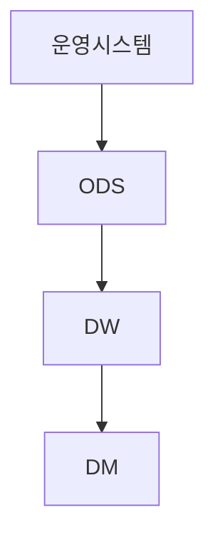

아래는 **ODS(Operational Data Store)에서 ETL 프로세스를 구성하는
Interface → Staging → Profiling → Cleansing → Integration → Export 레이어**를
**ADP 필기시험 답안용으로 간결하게 정리한 표**입니다.

> ✔ ADP 서술형·객관식 모두 대응
> ✔ “역할 중심”으로 요약
> ✔ 한 줄씩 외워도 되는 수준

------

## 📘 ODS ETL 레이어별 요약 표

| 레이어                | 주요 역할   | 핵심 설명 (시험용 한 줄)                                     |
| --------------------- | ----------- | ------------------------------------------------------------ |
| **Interface Layer**   | 데이터 수집 | 외부 시스템으로부터 원천 데이터를 추출하여 ODS로 유입하는 계층 |
| **Staging Layer**     | 임시 저장   | 추출된 데이터를 가공 없이 임시로 저장하는 중간 영역          |
| **Profiling Layer**   | 데이터 진단 | 데이터 분포, 결측치, 이상치 등을 분석하여 품질을 점검        |
| **Cleansing Layer**   | 데이터 정제 | 오류, 중복, 결측 데이터를 정제하여 데이터 품질을 개선        |
| **Integration Layer** | 데이터 통합 | 여러 원천 데이터 간 정합성을 맞추고 통합된 데이터로 구성     |
| **Export Layer**      | 데이터 제공 | 통합된 데이터를 DW, DM 또는 분석 시스템으로 전달             |

------

## ✍️ ADP 시험용 핵심 포인트 정리

- **Staging**: *가공 ❌, 임시 저장 ⭕*
- **Profiling**: *“분석”이지만 모델링 아님 → 데이터 품질 진단*
- **Cleansing**: *정제·보정·표준화*
- **Integration**: *키 정합성, 코드 통합, 중복 제거*
- **Export**: *ODS → DW/DM/분석 시스템*

------

## 🧠 서술형에서 쓰기 좋은 한 문단 예시

> ODS의 ETL 프로세스는 Interface Layer에서 원천 데이터를 수집한 후,
> Staging Layer에 임시 저장하고 Profiling Layer에서 데이터 품질을 진단한다.
> 이후 Cleansing Layer에서 데이터를 정제하고 Integration Layer에서 통합하여
> 최종적으로 Export Layer를 통해 분석 또는 DW 시스템으로 제공한다.

👉 이 문단은 **그대로 써도 감점 없는 답안**입니다.

------

알겠습니다.
아래는 요청하신 **1, 2, 3번을 ADP 필기시험 기준으로 바로 쓰기 가능한 표 요약**으로 정리한 자료입니다.
(객관식·서술형 모두 대응)

------

# 1️⃣ ODS vs DW vs DM 차이 정리

## 📘 데이터 저장소 비교 표

| 구분        | ODS (Operational Data Store) | DW (Data Warehouse)  | DM (Data Mart)       |
| ----------- | ---------------------------- | -------------------- | -------------------- |
| 목적        | 운영 데이터 통합             | 전사 분석 지원       | 부서·주제별 분석     |
| 데이터 성격 | 최신 데이터                  | 이력 데이터          | 요약·분석 데이터     |
| 갱신 주기   | 실시간 / 근실시간            | 배치 중심            | 배치                 |
| 데이터 범위 | 전사 운영 데이터             | 전사 통합 데이터     | 특정 업무 영역       |
| 정규화 수준 | 비교적 높음                  | 낮음(비정규화)       | 매우 낮음            |
| 사용 대상   | 운영 시스템, 실시간 조회     | 분석가, 의사결정자   | 부서 사용자          |
| ADP 포인트  | **DW 전 단계**               | **중앙 분석 저장소** | **목적 특화 저장소** |

### ✍️ 시험용 핵심 문장

> ODS는 운영 시스템과 DW 사이의 완충 역할을 수행하며, 최신 데이터를 통합·제공한다.

------

# 2️⃣ ETL vs ELT 비교 (ADP 단골)

## 📘 데이터 적재 방식 비교 표

| 구분      | ETL                        | ELT                        |
| --------- | -------------------------- | -------------------------- |
| 순서      | Extract → Transform → Load | Extract → Load → Transform |
| 변환 위치 | 중간 처리 서버             | DW 내부                    |
| 처리 방식 | 사전 가공                  | 사후 가공                  |
| 성능 특성 | 안정적, 전통적             | 대용량 처리에 유리         |
| 인프라    | 별도 ETL 서버 필요         | DW 연산 자원 활용          |
| 대표 환경 | 전통적 DW                  | 클라우드 DW                |
| ADP 관점  | **관리·통제 용이**         | **확장성 우수**            |

### ✍️ 시험용 핵심 문장

> ETL은 데이터 적재 전 변환을 수행하는 방식이며, ELT는 적재 후 변환을 수행하여 대용량 처리에 유리하다.

------

# 3️⃣ ODS가 실시간 분석에 적합한 이유

## 📘 ODS 실시간성 특징 요약

| 항목        | 설명                 |
| ----------- | -------------------- |
| 데이터 시점 | 최신 데이터 중심     |
| 갱신 방식   | 실시간 또는 근실시간 |
| 처리 목적   | 운영 모니터링        |
| 데이터 구조 | 비교적 정규화        |
| 분석 유형   | 현황 파악, 즉시 대응 |

### ✔ ODS가 DW보다 실시간에 적합한 이유

- DW는 **이력 중심·배치 처리**
- ODS는 **운영 데이터 통합·즉시 조회**

### ✍️ 서술형 만점 문장

> ODS는 최신 운영 데이터를 실시간 또는 근실시간으로 통합·제공하므로, 실시간 모니터링과 즉각적인 의사결정에 적합하다.

------

# 🧠 시험 직전 초압축 암기 세트

- **ODS**: 최신·운영·실시간
- **DW**: 이력·전사·분석
- **DM**: 부서·요약·목적
- **ETL**: 변환 후 적재
- **ELT**: 적재 후 변환

------

아래는 요청하신 **1️⃣ ODS↔DW↔DM 데이터 흐름 그림 설명**, **2️⃣ ODS 관련 객관식 함정 문제 TOP 10**, **3️⃣ ETL/ODS/DW 서술형 예상문제 + 모범답안**을 **ADP 필기시험 기준**으로 정리한 자료입니다.
(객관식·서술형 모두 바로 활용 가능)

------

# 1️⃣ ODS ↔ DW ↔ DM 데이터 흐름 (그림 설명용 요약)

## 📘 데이터 흐름 개념 정리

### 단계별 역할 요약

- **운영시스템 → ODS**
  - 실시간/근실시간 데이터 수집
  - 이기종 운영 데이터 통합
  - 최신 상태 유지
- **ODS → DW**
  - 데이터 정합성 확보
  - 이력 데이터 축적
  - 분석 최적화 구조로 변환
- **DW → DM**
  - 부서·주제별 데이터 제공
  - 요약·집계 중심
  - 사용자 친화적 구조

### ✍️ 서술형 핵심 문장

> ODS는 운영 시스템과 DW 사이에서 최신 데이터를 통합하는 완충 계층이며, DW는 전사 분석을 위한 이력 데이터를 저장하고 DM은 특정 목적의 분석을 지원한다.

------

# 2️⃣ ODS 관련 객관식 **함정 문제 TOP 10**

아래는 **자주 틀리는 포인트 중심**입니다.

| 번호 | 함정 질문                       | 정답 포인트          |
| ---- | ------------------------------- | -------------------- |
| 1    | ODS는 이력 데이터를 저장한다    | ❌ (최신 데이터 중심) |
| 2    | ODS는 DM의 하위 개념이다        | ❌                    |
| 3    | ODS는 배치 처리만 한다          | ❌ (실시간/근실시간)  |
| 4    | ODS는 비정규화가 기본이다       | ❌ (비교적 정규화)    |
| 5    | ODS의 목적은 분석 최적화이다    | ❌ (운영 통합)        |
| 6    | ODS는 DW를 대체한다             | ❌                    |
| 7    | ODS는 데이터 마트를 생성한다    | ❌                    |
| 8    | ODS는 실시간 조회에 부적합하다  | ❌                    |
| 9    | ODS는 과거 이력 분석에 적합하다 | ❌                    |
| 10   | ODS는 DW 이후 단계이다          | ❌ (DW 이전)          |

### ✔ 시험에서 맞는 문장

> ODS는 DW 구축 이전 단계에서 운영 데이터를 통합·제공하는 저장소이다.

------

# 3️⃣ ETL / ODS / DW 서술형 예상문제 + 모범답안

## 🔴 예상문제 1

**ODS의 역할과 DW와의 차이를 설명하시오.**

### ✅ 모범답안

> ODS는 운영 시스템에서 발생하는 최신 데이터를 실시간 또는 근실시간으로 통합하여 제공하는 저장소이다.
> 반면 DW는 전사적 분석을 위해 이력 데이터를 장기간 저장하는 분석 중심 저장소이다.
> 따라서 ODS는 운영 모니터링에, DW는 전략적 의사결정에 활용된다.

------

## 🔴 예상문제 2

**ETL과 ELT의 차이를 설명하시오.**

### ✅ 모범답안

> ETL은 데이터를 추출한 후 변환하여 저장하는 방식으로 전통적인 DW 환경에서 사용된다.
> ELT는 데이터를 먼저 저장한 후 변환을 수행하는 방식으로, 클라우드 기반 대용량 데이터 처리에 유리하다.

------

## 🔴 예상문제 3

**ODS가 실시간 분석에 적합한 이유를 설명하시오.**

### ✅ 모범답안

> ODS는 최신 운영 데이터를 실시간 또는 근실시간으로 갱신하므로 현황 파악과 즉각적인 의사결정에 적합하다.
> 반면 DW는 배치 기반 이력 데이터를 중심으로 하여 실시간 분석에는 상대적으로 부적합하다.

------

## 🔴 예상문제 4

**ODS–DW–DM 구조를 사용하는 이유를 설명하시오.**

### ✅ 모범답안

> ODS–DW–DM 구조는 운영 데이터 처리, 전사 분석, 부서별 분석을 단계적으로 분리함으로써 성능과 관리 효율성을 높인다.
> 이를 통해 실시간 운영과 전략적 분석을 동시에 지원할 수 있다.

------

# ✅ 시험 직전 초압축 암기 (이 블록만 봐도 됨)

- **ODS**: 최신 · 운영 · 실시간 · DW 이전
- **DW**: 이력 · 전사 · 분석
- **DM**: 부서 · 요약 · 목적
- **ETL**: 변환 후 적재
- **ELT**: 적재 후 변환

------

알겠습니다.
아래는 **ADP 필기시험 난이도 기준**으로 제작한
**「ODS / DW / ETL 객관식 고난도 20제」**입니다.

> ✔ ADsP에서는 거의 안 나오고 ADP에서 **헷갈리게 출제되는 유형**
> ✔ 실제 시험과 동일한 **객관식 스타일**
> ✔ 각 문항에 **정답 + 함정 해설** 포함

------

# 📝 ADP 고난도 객관식

## ODS · DW · ETL 20문항

------

## 1️⃣ ODS의 주된 목적은?

A. 장기 이력 분석
B. 부서별 요약 데이터 제공
C. 최신 운영 데이터 통합
D. 통계 모델 학습

**정답: C**
📌 ODS = 최신·운영·통합 (분석 ❌)

------

## 2️⃣ 다음 중 ODS의 특징으로 옳지 않은 것은?

A. 실시간 또는 근실시간 갱신
B. DW 이전 단계
C. 비정규화 구조
D. 운영 시스템 통합

**정답: C**
📌 ODS는 **비교적 정규화**

------

## 3️⃣ ODS와 DW의 가장 큰 차이는?

A. 저장 용량
B. 데이터 최신성
C. 데이터 암호화
D. 사용자 수

**정답: B**

------

## 4️⃣ DW의 주요 목적은?

A. 실시간 운영 모니터링
B. 이력 데이터 기반 분석
C. 원천 데이터 수집
D. 데이터 정합성 검사

**정답: B**

------

## 5️⃣ DW 데이터 구조로 가장 적절한 것은?

A. 완전 정규화
B. 비정규화
C. JSON
D. 키-값 구조

**정답: B**

------

## 6️⃣ DM(Data Mart)의 설명으로 옳은 것은?

A. 전사 데이터 통합 저장소
B. 실시간 데이터 처리 전용
C. 부서·주제별 분석 저장소
D. 원천 시스템

**정답: C**

------

## 7️⃣ ODS → DW → DM 구조를 사용하는 이유로 가장 적절한 것은?

A. 저장 공간 축소
B. 데이터 중복 제거
C. 역할 분리로 성능·관리 효율 향상
D. 분석 알고리즘 단순화

**정답: C**

------

## 8️⃣ ETL의 올바른 처리 순서는?

A. Load → Transform → Extract
B. Transform → Extract → Load
C. Extract → Transform → Load
D. Load → Extract → Transform

**정답: C**

------

## 9️⃣ ELT 방식의 특징으로 옳은 것은?

A. 변환을 ETL 서버에서 수행
B. 변환 후 적재
C. 적재 후 변환
D. 소규모 데이터에 적합

**정답: C**

------

## 🔟 ELT가 특히 적합한 환경은?

A. 전통적 온프레미스 DW
B. 클라우드 기반 DW
C. 소규모 RDB
D. 로컬 파일 시스템

**정답: B**

------

## 1️⃣1️⃣ Staging Layer의 역할로 옳은 것은?

A. 데이터 품질 진단
B. 데이터 통합
C. 데이터 임시 저장
D. 분석 모델 생성

**정답: C**

------

## 1️⃣2️⃣ Profiling Layer에서 수행하는 작업은?

A. 데이터 변환
B. 결측치·분포 분석
C. 데이터 적재
D. 리포트 생성

**정답: B**

------

## 1️⃣3️⃣ Cleansing Layer의 주요 작업이 아닌 것은?

A. 중복 제거
B. 결측치 처리
C. 코드 통합
D. 데이터 시각화

**정답: D**

------

## 1️⃣4️⃣ Integration Layer의 핵심 목적은?

A. 데이터 수집
B. 데이터 정합성 확보
C. 모델 성능 개선
D. 실시간 분석

**정답: B**

------

## 1️⃣5️⃣ Export Layer의 역할로 가장 적절한 것은?

A. 데이터 진단
B. 데이터 정제
C. 분석 시스템으로 전달
D. 원천 시스템 백업

**정답: C**

------

## 1️⃣6️⃣ 다음 중 ETL 설계 시 고려 사항이 아닌 것은?

A. 데이터 품질
B. 처리 주기
C. 데이터 정합성
D. 모델 정확도

**정답: D**

------

## 1️⃣7️⃣ ODS에서 이력 데이터 관리가 제한적인 이유는?

A. 저장 비용
B. 실시간 성능 유지
C. 데이터 암호화
D. 분석 부적합

**정답: B**

------

## 1️⃣8️⃣ DW에 데이터를 적재하기 전 ODS를 거치는 이유는?

A. 데이터 압축
B. 최신 데이터 통합
C. 시각화 처리
D. 모델링 자동화

**정답: B**

------

## 1️⃣9️⃣ 다음 중 ODS에 가장 적합한 사용 사례는?

A. 연도별 매출 추이 분석
B. 실시간 주문 현황 조회
C. 부서별 KPI 리포트
D. 장기 고객 분석

**정답: B**

------

## 2️⃣0️⃣ ADP 시험 관점에서 ODS/DW/DM 구분의 핵심 키워드는?

A. 저장 용량
B. 데이터 최신성·목적
C. 서버 종류
D. 파일 포맷

**정답: B**

------

# ✅ 점수 기준 (이 세트)

- **16개 이상 정답** → 매우 안정권
- **13~15개** → 합격권
- **12개 이하** → 개념 재정리 필요

------

아주 좋은 선택입니다.
아래는 **ADP 필기 객관식에서 수험생을 헷갈리게 하려고 자주 쓰는
‘말장난·표현 트릭’ 정리 노트**입니다.

> 🎯 목적
>
> - “아는 내용인데 틀리는” 상황 방지
> - **ODS / DW / ETL / 분석 전반**에서 반복되는 함정 표현 제거

------

# 📘 ADP 객관식

## 자주 나오는 ‘말장난 표현’ 정리

------

## Ⅰ. ODS / DW / DM 관련 말장난

### 1️⃣ “실시간” vs “실시간에 가까운”

❌ 함정 문장

> ODS는 실시간 데이터를 저장한다.

⭕ 올바른 해석

> ODS는 **실시간 또는 근실시간(near real-time)** 데이터를 처리한다.

📌 포인트

- “완전 실시간만” 강조 → ❌
- “근실시간 포함” → ⭕

------

### 2️⃣ “이력 데이터”

❌

> ODS는 이력 데이터를 장기간 저장한다.

⭕

> ODS는 **최신 데이터 중심**, 이력은 DW에서 관리한다.

------

### 3️⃣ “분석 최적화”

❌

> ODS는 분석 최적화를 위해 설계되었다.

⭕

> ODS는 **운영 데이터 통합**을 목적으로 한다.
> 분석 최적화는 DW/DM의 역할이다.

------

### 4️⃣ “비정규화”

❌

> ODS는 비정규화 구조를 사용한다.

⭕

> ODS는 **비교적 정규화**,
> DW/DM은 비정규화 구조를 사용한다.

------

## Ⅱ. ETL / ELT 관련 말장난

### 5️⃣ “변환 후 적재” vs “적재 후 변환”

❌

> ETL과 ELT의 차이는 거의 없다.

⭕

> ETL은 **변환 후 적재**,
> ELT는 **적재 후 변환**이다.

📌 시험 포인트

- 순서가 바뀌면 **완전히 다른 방식**

------

### 6️⃣ “대용량 처리에 유리”

❌

> ETL은 대용량 처리에 유리하다.

⭕

> **ELT**가 대용량 처리에 유리하다
> (DW 연산 자원 활용)

------

### 7️⃣ “클라우드 환경”

❌

> ETL은 클라우드 환경에 최적화되어 있다.

⭕

> **ELT**가 클라우드 DW 환경에 적합하다.

------

## Ⅲ. 데이터 분석 기획 관련 말장난

### 8️⃣ “현상” vs “분석 문제”

❌

> 매출 감소가 분석 문제이다.

⭕

> 매출 감소는 **현상**,
> 분석 문제는 “매출 감소 요인 규명”이다.

📌 객관식에서

- “~현상” → ❌
- “~요인을 분석한다” → ⭕

------

### 9️⃣ “KPI = 목표”

❌

> KPI는 목표 자체이다.

⭕

> KPI는 **목표 달성 여부를 측정하는 지표**이다.

------

### 🔟 “분석 실패 원인”

❌

> 분석 실패의 주요 원인은 모델 성능 부족이다.

⭕

> 분석 실패의 주요 원인은 **기획 단계 문제**이다.

------

## Ⅳ. 통계·분석 관련 말장난

### 1️⃣1️⃣ p-value 관련

❌

> p-value는 귀무가설이 틀릴 확률이다.

⭕

> p-value는 **귀무가설이 참일 때 관측값 이상이 나올 확률**이다.

------

### 1️⃣2️⃣ “이상”

❌

> 관측값보다 큰 값

⭕

> **관측값보다 더 극단적인 값**
> (단측/양측 구분 필요)

------

### 1️⃣3️⃣ Accuracy 관련

❌

> Accuracy가 높으면 모델이 우수하다.

⭕

> 불균형 데이터에서는 Accuracy가 성능을 왜곡할 수 있다.

------

## Ⅴ. 머신러닝 관련 말장난

### 1️⃣4️⃣ Random Forest 설명

❌

> Random Forest는 정확도가 높은 모델이다.

⭕

> Random Forest는 **분산을 감소시켜 과적합을 완화하는 앙상블 기법**이다.

------

### 1️⃣5️⃣ PCA 오해

❌

> PCA는 중요한 변수를 선택한다.

⭕

> PCA는 **새로운 축(주성분)을 생성**한다.

------

### 1️⃣6️⃣ 정규화 vs 표준화

❌

> 정규화는 데이터를 표준화하는 것이다.

⭕

> 정규화(Regularization)는 **모델 복잡도 제어**,
> 표준화(Standardization)는 **데이터 스케일 조정**이다.

------

## Ⅵ. 시각화 관련 말장난

### 1️⃣7️⃣ “보기 좋게”

❌

> 시각화는 보기 좋게 만드는 것이 목적이다.

⭕

> 시각화의 목적은 **정확한 정보 전달**이다.

------

### 1️⃣8️⃣ “색상 많이 사용”

❌

> 색상을 많이 사용할수록 가독성이 좋아진다.

⭕

> 색상은 **의미 전달 목적에 맞게 최소화**해야 한다.

------

## ✅ 시험 직전 암기용 요약 (이것만 기억)

- ODS = 최신 · 운영 · 실시간/근실시간
- DW = 이력 · 분석
- DM = 부서 · 요약
- ETL = 변환 → 적재
- ELT = 적재 → 변환
- p-value = 귀무가설 참 가정
- Accuracy = 불균형 데이터에 취약

------

아래는 **ADP 필기시험 기준으로 반드시 알아야 하는
데이터 웨어하우스(DW) 테이블 모델링 기법 요약**입니다.

> ✔ 객관식·서술형 모두 출제
> ✔ ADsP 대비 **DW 설계 관점(왜 이 모델을 쓰는가)**까지 포함
> ✔ 시험장에서 바로 쓰는 문장 제공

------

# 📘 데이터 웨어하우스 테이블 모델링 기법 요약

## 1️⃣ 차원 모델링 (Dimensional Modeling) ⭐⭐⭐

DW에서 **가장 핵심이 되는 모델링 기법**입니다.

### 📌 기본 개념

- **Fact Table(사실 테이블)** + **Dimension Table(차원 테이블)** 구조
- 분석·집계 성능 최적화 목적

------

## 2️⃣ 스타 스키마 (Star Schema) ⭐⭐⭐

### 🔹 구조

- 중앙에 **Fact Table**
- 주변에 **Dimension Table**이 방사형으로 연결

### 🔹 특징 요약

| 항목    | 내용                  |
| ------- | --------------------- |
| 구조    | 단순한 별 모양        |
| 조인 수 | 적음                  |
| 성능    | 우수                  |
| 이해도  | 높음                  |
| 중복    | 차원 데이터 중복 발생 |

### ✍️ 시험용 핵심 문장

> 스타 스키마는 단순한 구조로 조회 성능이 우수하여 DW에서 가장 널리 사용된다.

------

## 3️⃣ 스노우플레이크 스키마 (Snowflake Schema)

### 🔹 구조

- 차원 테이블을 **정규화**
- 차원이 여러 테이블로 분리

### 🔹 특징 요약

| 항목    | 내용                 |
| ------- | -------------------- |
| 구조    | 눈송이 형태          |
| 조인 수 | 많음                 |
| 성능    | 스타 스키마보다 낮음 |
| 중복    | 감소                 |
| 관리    | 복잡                 |

### ✍️ 시험용 문장

> 스노우플레이크 스키마는 차원 테이블을 정규화하여 저장 공간을 절약하나, 조인 증가로 성능이 저하될 수 있다.

------

## 4️⃣ 팩트 테이블 유형 ⭐⭐⭐

### ① 트랜잭션 팩트 (Transaction Fact)

| 항목  | 내용        |
| ----- | ----------- |
| 단위  | 개별 이벤트 |
| 예    | 주문, 결제  |
| 행 수 | 매우 많음   |

------

### ② 스냅샷 팩트 (Snapshot Fact)

| 항목 | 내용        |
| ---- | ----------- |
| 단위 | 특정 시점   |
| 예   | 일별 재고   |
| 특징 | 주기적 적재 |

------

### ③ 누적 스냅샷 팩트 (Accumulating Snapshot Fact)

| 항목 | 내용               |
| ---- | ------------------ |
| 단위 | 프로세스 전체      |
| 예   | 주문 → 배송 → 완료 |
| 특징 | 여러 날짜 컬럼     |

### ✍️ 단골 문장

> 트랜잭션 팩트는 이벤트 단위 데이터를 저장하며, 스냅샷 팩트는 시점 기준 상태를 저장한다.

------

## 5️⃣ 차원 테이블 설계 핵심 ⭐⭐⭐

### 🔹 서러게이트 키 (Surrogate Key)

- 시스템 생성 키
- 비즈니스 키와 분리
- 변경에 안전

📌 시험 포인트

> DW에서는 자연키보다 서러게이트 키를 사용한다.

------

### 🔹 SCD (Slowly Changing Dimension) ⭐⭐⭐

차원 데이터 변경 관리 기법

| 유형   | 설명                | ADP 출제 |
| ------ | ------------------- | -------- |
| Type 1 | 이전 값 덮어쓰기    | ⭕        |
| Type 2 | 이력 관리 (행 추가) | ⭐⭐⭐      |
| Type 3 | 이전 값 일부 보관   | △        |

### ✍️ 핵심 문장

> SCD Type 2는 차원 데이터 변경 이력을 관리하기 위해 새로운 행을 추가한다.

------

## 6️⃣ 정규화 vs 비정규화 관점 (DW 핵심)

| 구분 | OLTP          | DW        |
| ---- | ------------- | --------- |
| 목적 | 트랜잭션 처리 | 분석·집계 |
| 구조 | 정규화        | 비정규화  |
| 조인 | 최소화        | 허용      |
| 성능 | 쓰기 중심     | 읽기 중심 |

📌 시험용 문장

> DW는 조회 성능 향상을 위해 비정규화 구조를 사용한다.

------

## 7️⃣ 데이터 마트(DM) 모델링 특징

- DW 기반
- 부서·주제 중심
- 스타 스키마 주로 사용

------

## ✅ 시험 직전 초압축 암기 세트

- **DW 핵심** = 차원 모델링
- **스타 스키마** = 성능 우수
- **스노우플레이크** = 정규화, 조인 증가
- **팩트 유형** = 트랜잭션 / 스냅샷 / 누적 스냅샷
- **SCD Type 2** = 이력 관리
- **DW** = 비정규화

------

# CDC(Change Data Capture) 핵심 정리

## 1. 개요

- **정의:** 데이터베이스의 데이터가 변경(Insert, Update, Delete)되었을 때, 그 변경된 데이터를 식별하고 추출하여 타겟 시스템(DW, 실시간 분석 등)에 실시간으로 반영하는 기술.
- **목적:** 전수 데이터를 매번 옮기는 Full Load의 부하를 줄이고, 소스 시스템과 타겟 시스템 간의 **데이터 동기화 지연(Latency)**을 최소화함.

## 2. 주요 구현 기법 (시험 빈출)

| **기법**         | **작동 방식**                                                | **장점**                                       | **단점**                                             |
| ---------------- | ------------------------------------------------------------ | ---------------------------------------------- | ---------------------------------------------------- |
| **Time Stamp**   | 데이터 행(Row)에 수정 시간을 기록하는 컬럼을 두어, 특정 시간 이후 변경분을 추출 | 구현이 매우 쉽고 별도 툴이 필요 없음           | **Delete(삭제)** 감지 불가, 운영 DB에 컬럼 추가 필요 |
| **Trigger**      | 테이블에 트리거를 설정하여 변경 발생 시 별도의 로그 테이블에 기록 | 실시간성이 높고 신뢰도가 좋음                  | 운영 DB의 **성능 저하(Overhead)**가 심함             |
| **Log Based**    | DB의 **Redo Log**나 **Archive Log**를 직접 읽어서 변경 사항 추출 | **운영 DB 성능 영향 최소**, 가장 이상적인 방식 | 로그 포맷 분석 기술 필요, 설정이 복잡함              |
| **Shadow Table** | 변경된 데이터만 별도의 복제(Shadow) 테이블에 저장하여 관리   | 원본 데이터 보존성이 좋음                      | 저장 공간 추가 필요, 데이터 관리 복잡도 상승         |

## 3. 구현 방식 비교 (서술형 키워드)

### ① 푸시(Push) 방식

- 소스 시스템에서 변경이 일어나면 즉시 타겟 시스템으로 데이터를 전송.
- **특징:** 실시간성이 매우 높으나 타겟 시스템에 부하를 줄 수 있음.

### ② 풀(Pull) 방식

- 타겟 시스템이나 미들웨어가 주기적으로 소스 시스템을 조회하여 데이터를 가져옴.
- **특징:** 타겟 시스템이 처리 가능한 시점에 데이터를 가져오므로 안정적이나 실시간성은 다소 떨어짐.

------

## 4. ADP 서술형 예상 질문 & 모범 답안 예시

**Q. 로그 기반(Log-based) CDC 방식이 다른 방식보다 선호되는 이유를 서술하시오.**

> [모범 답안]
>
> 로그 기반 CDC는 소스 데이터베이스의 트랜잭션 로그(Redo Log 등)를 직접 읽어 변경 사항을 감지합니다. 이 방식은 첫째, 운영 데이터베이스의 리소스를 직접 점유하지 않아 성능 부하(Overhead)를 최소화합니다. 둘째, 별도의 애플리케이션 수정이나 테이블 구조 변경(Timestamp 등)이 필요 없어 **비침습적(Non-intrusive)**입니다. 셋째, 다른 방식에서 감지하기 어려운 Delete 연산까지도 완벽하게 추적할 수 있기 때문에 데이터 정합성이 중요한 DW 구축 환경에서 가장 선호됩니다.

------

## 💡 학습 팁

1. **Mermaid 활용:** 위 표의 내용을 아까 만든 `.md` 파일에 넣으실 때, 앞서 설명해 드린 Mermaid 문법으로 `Time Stamp -> 성능 낮음`, `Log Based -> 성능 높음` 식의 비교 차트를 그려보세요.
2. **연관 키워드:** **ETL**(Extract, Transform, Load)과의 차이점을 함께 공부하세요. (ETL은 배치 방식 위주, CDC는 실시간성 위주)

